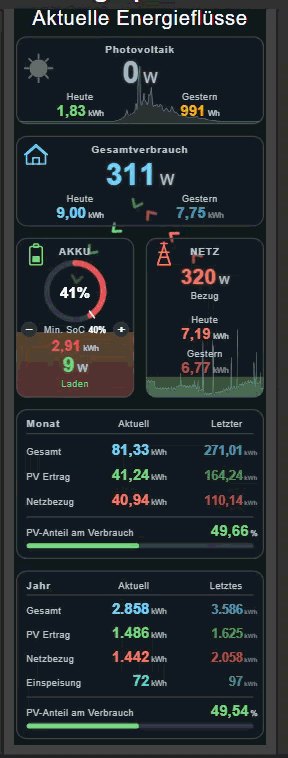

# [HABPanel] Energy flow widget – PV, battery, grid, house (mobile, portrait)

A custom HABPanel widget that shows the current energy flows of a PV system with battery storage, optimised for smartphones in portrait mode (built and tested on a Pixel 9).

🇩🇪 [Deutsche Anleitung](README.de.md)

## Features

- **Live flows** between PV, house, battery and grid with animated arrows. Arrow speed follows the power (3 levels with hysteresis), animation runs on the GPU and stays smooth during item updates.
- **Tiles fill from bottom to top** (Victron style) with a traffic-light gradient:
  - PV: by current power
  - Battery: by state of charge
  - Grid: by import power (export shown in teal)
- **24 h history charts** in the PV and grid tiles, taken from the openHAB chart servlet (rrd4j), with axes cropped away
- **Battery tile:** SoC ring with minimum-SoC marker, remaining capacity (kWh) with traffic light, **+/- buttons to change the minimum SoC** directly from the widget
- **Month and year tiles:** consumption, PV yield, grid import, export, PV share of consumption with progress bar (both tiles can be hidden)
- **All items configurable** via the widget settings – no item names need to be edited in the code

## Requirements

- openHAB with HABPanel (tested on openHAB 2.4)
- rrd4j persistence for the PV power and grid power items (for the charts)
- A current browser (Chrome / Android WebView 105 or newer). The arrow animation uses CSS container query units (`cqw`).

## Installation

1. Download the widget file from the [`widget`](widget) folder:
   - [`energy-flow-widget_en.json`](widget/energy-flow-widget_en.json) – English settings and labels
   - [`energiefluss-widget_de.json`](widget/energiefluss-widget_de.json) – German settings and labels
2. HABPanel → Settings → **Custom widgets** → *Import widget* and select the file
   (alternatively create a new custom widget and paste [`template/energy-flow-widget.html`](template/energy-flow-widget.html); the settings then have to be created by hand).
3. Add the widget to a dashboard and open its settings.
4. Select your items in the **Settings** tab (see table below).

## Settings

### Items

| ID | Description |
|---|---|
| `pvPower` | Current PV power (W) |
| `pvYieldToday` | PV yield today (Wh) |
| `pvYieldYesterday` | PV yield yesterday (kWh) |
| `pvYieldMonth` / `pvYieldMonthLast` | PV yield this / last month (kWh) |
| `pvYieldYear` / `pvYieldYearLast` | PV yield this / last year (kWh) |
| `pvShareMonth` / `pvShareYear` | PV share of consumption, month / year (%) |
| `gridPower` | Grid power (W), positive = import, negative = export |
| `gridImportToday` / `gridImportYesterday` | Grid import today / yesterday (kWh) |
| `gridImportMonth` / `gridImportMonthLast` | Grid import this / last month (kWh) |
| `gridImportYear` / `gridImportYearLast` | Grid import this / last year (kWh) |
| `gridExportYear` / `gridExportYearLast` | Grid export this / last year (kWh) |
| `loadToday` / `loadYesterday` | Total consumption today / yesterday (kWh) |
| `loadMonth` / `loadMonthLast` | Total consumption this / last month (kWh) |
| `loadYear` / `loadYearLast` | Total consumption this / last year (kWh) |
| `battPower` | Battery power (W), positive = charging, negative = discharging |
| `battSoc` | Battery state of charge (%) |
| `battEnergy` | Remaining battery energy (kWh) |
| `minSocLimit` | Minimum SoC (%), written by the +/- buttons |

### Numbers

| ID | Default | Description |
|---|---|---|
| `pvMaxW` | 1500 | PV power at which the PV tile is completely filled (inverter peak power) |
| `gridMaxW` | 3000 | Grid import at which the grid tile is completely filled |
| `battCapacity` | 7.5 | Usable battery capacity (kWh) |
| `socStep` | 5 | Step size of the +/- buttons (%) |
| `socMinAllowed` | 5 | Lowest minimum SoC the buttons allow (%) |
| `socMaxAllowed` | 95 | Highest minimum SoC the buttons allow (%) |

### Switches and text

| ID | Type | Description |
|---|---|---|
| `hideMonth` | Checkbox | Hide the month tile (year tile moves up) |
| `hideYear` | Checkbox | Hide the year tile |
| `hideChart` | Checkbox | Hide the PV history chart |
| `hideGridChart` | Checkbox | Hide the grid history chart |
| `chartPeriod` | Text | Chart period: `h`, `4h`, `8h`, `12h`, `D` (default, 24 h), `3D`, `W` |
| `gridChartPeriod` | Text | Period of the grid chart, empty = same as `chartPeriod` |
| `language` | Text | `en` = English labels, anything else = German (default) |
| `scrollInside` | Checkbox | Let the widget scroll by itself. Only needed if the tile is smaller than the widget; otherwise make the tile tall enough and leave this off |

## Notes and limitations

- **Charts:** The widget loads the image from `/chart?...` and crops the axes away. The cropping is calibrated for the default chart servlet layout. With very different value ranges (e.g. long y-axis labels like `-1.000`) the curve may shift slightly at the left edge.
- **Chart scale:** The chart servlet scales automatically to the highest value, so short peaks compress the rest of the curve.
- **Labels** are German by default. Set `language` to `en` for English labels.
- **All items must be set** in the widget settings, the template contains no item names.
- **Items with units** (e.g. `Number:Power` with "257 W") are supported. The unit is split off; W/kW and Wh/kWh/MWh are converted automatically. The +/- buttons send the minimum SoC with the item's unit (e.g. "40 %").
- **Flow arrows** are tied to the positions of the PV, house, battery and grid tiles, so these tiles cannot be hidden.

## Changelog

- **v3.4** – No scroll delay; new setting `scrollInside`
- **v3.3** – Smoother scrolling on smartphones
- **v3.2** – Number settings show their default values in the HABPanel settings dialog
- **v3.1** – Support for items with units (openHAB 3 and newer)
- **v3.0** – First public version: all items via settings, German/English labels, history charts for PV and grid, hideable tiles, Victron-style fill

Feedback and improvements are welcome – please open an issue.

## License

MIT, see [LICENSE](LICENSE).
